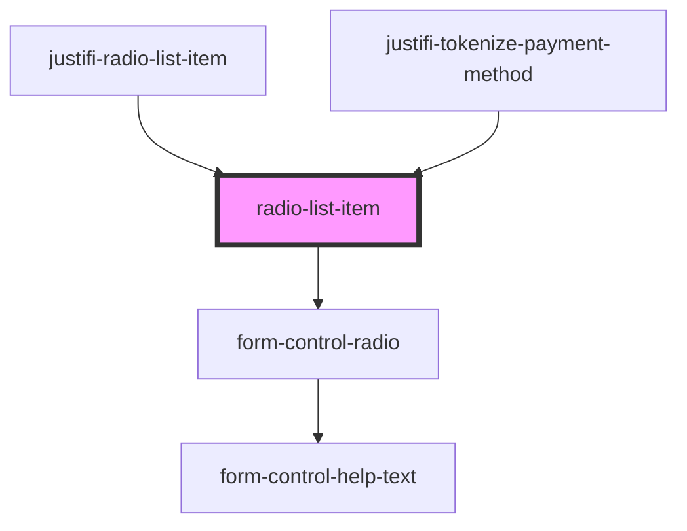

# radio-list-item

<!-- Auto Generated Below -->

## Properties

| Property             | Attribute | Description | Type      | Default     |
| -------------------- | --------- | ----------- | --------- | ----------- |
| `checked`            | `checked` |             | `boolean` | `false`     |
| `class`              | `class`   |             | `string`  | `undefined` |
| `hidden`             | `hidden`  |             | `boolean` | `false`     |
| `label` _(required)_ | `label`   |             | `any`     | `undefined` |
| `name` _(required)_  | `name`    |             | `string`  | `undefined` |
| `value` _(required)_ | `value`   |             | `string`  | `undefined` |

## Events

| Event         | Description | Type                  |
| ------------- | ----------- | --------------------- |
| `radio-click` |             | `CustomEvent<string>` |

## Dependencies

### Used by

 - [justifi-radio-list-item](shadow-dom-components)
 - [justifi-tokenize-payment-method](../components/tokenize-payment-method)

### Depends on

- [form-control-radio](form)

### Graph

----------------------------------------------

*Built with [StencilJS](https://stenciljs.com/)*
