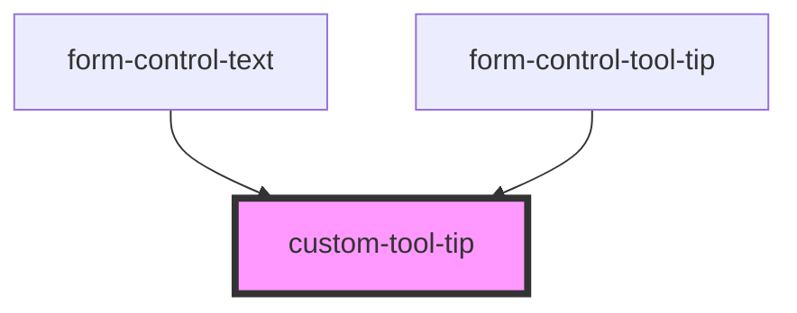

# form-control-tool-tip

<!-- Auto Generated Below -->

## Properties

| Property | Attribute | Description | Type     | Default     |
| -------- | --------- | ----------- | -------- | ----------- |
| `text`   | `text`    |             | `string` | `undefined` |

## Shadow Parts

| Part        | Description |
| ----------- | ----------- |
| `"tooltip"` |             |

## Dependencies

### Used by

 - [form-control-text](../components/form)
 - [form-control-tool-tip](../components/form)

### Graph

----------------------------------------------

*Built with [StencilJS](https://stenciljs.com/)*
