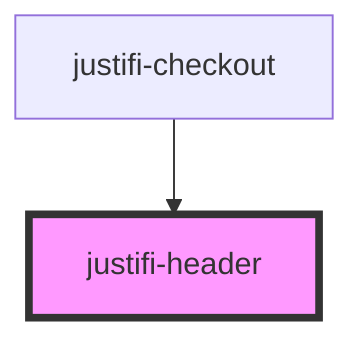

# justifi-header

<!-- Auto Generated Below -->

## Properties

| Property | Attribute | Description | Type                   | Default     |
| -------- | --------- | ----------- | ---------------------- | ----------- |
| `class`  | `class`   |             | `string`               | `undefined` |
| `level`  | `level`   |             | `"h1" \| "h2" \| "h3"` | `'h1'`      |
| `text`   | `text`    |             | `string`               | `undefined` |

## Dependencies

### Used by

 - [justifi-checkout](../../components/checkout)

### Graph

----------------------------------------------

*Built with [StencilJS](https://stenciljs.com/)*
