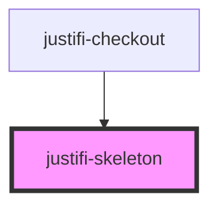

# justifi-header

<!-- Auto Generated Below -->

## Properties

| Property      | Attribute   | Description | Type                      | Default     |
| ------------- | ----------- | ----------- | ------------------------- | ----------- |
| `class`       | `class`     |             | `string`                  | `undefined` |
| `component`   | `component` |             | `string`                  | `undefined` |
| `customStyle` | --          |             | `{ [key: string]: any; }` | `undefined` |
| `height`      | `height`    |             | `number \| string`        | `undefined` |
| `width`       | `width`     |             | `number \| string`        | `undefined` |

## Dependencies

### Used by

 - [justifi-checkout](../../components/checkout)

### Graph

----------------------------------------------

*Built with [StencilJS](https://stenciljs.com/)*
