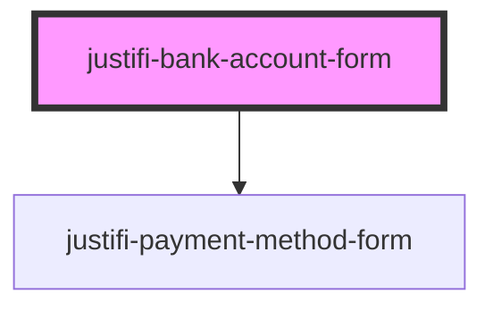

# justifi-bank-account-form

<!-- Auto Generated Below -->

## Properties

| Property         | Attribute         | Description                                               | Type                                                           | Default     |
| ---------------- | ----------------- | --------------------------------------------------------- | -------------------------------------------------------------- | ----------- |
| `iframeOrigin`   | `iframe-origin`   | URL for the rendered iFrame. End-users need not use this. | `string`                                                       | `undefined` |
| `validationMode` | `validation-mode` | When to trigger validation of the form.                   | `"all" \| "onBlur" \| "onChange" \| "onSubmit" \| "onTouched"` | `undefined` |

## Events

| Event                     | Description                                                   | Type                                            |
| ------------------------- | ------------------------------------------------------------- | ----------------------------------------------- |
| `bankAccountFormReady`    | Triggered when iframe has loaded                              | `CustomEvent<any>`                              |
| `bankAccountFormTokenize` | Triggered when the tokenize method is called on the component | `CustomEvent<{ data: any; }>`                   |
| `bankAccountFormValidate` | Triggered when the validate method is called on the component | `CustomEvent<{ data: { isValid: boolean; }; }>` |
| `ready`                   | Triggered when iframe has loaded                              | `CustomEvent<any>`                              |

## Methods

### `resize() => Promise<void>`

**[DEPRECATED]** This method will be removed in future releases.  Manually resizes the iframe to fit the contents of the iframe

#### Returns

Type: `Promise<void>`

### `tokenize(clientId: string, paymentMethodMetadata: any, account?: string) => Promise<CreatePaymentMethodResponse>`

Makes a tokenization request to the iframe

#### Returns

Type: `Promise<CreatePaymentMethodResponse>`

### `validate() => Promise<any>`

Runs a validation on the form and shows errors if any

#### Returns

Type: `Promise<any>`

## Dependencies

### Depends on

- [justifi-payment-method-form](../payment-method-form)

### Graph

----------------------------------------------

*Built with [StencilJS](https://stenciljs.com/)*
