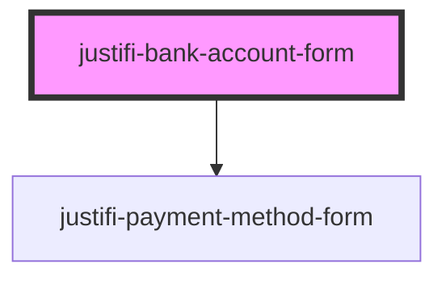

# justifi-card-form

<!-- Auto Generated Below -->

## Properties

| Property             | Attribute             | Description | Type                                                           | Default     |
| -------------------- | --------------------- | ----------- | -------------------------------------------------------------- | ----------- |
| `validationStrategy` | `validation-strategy` |             | `"all" \| "onBlur" \| "onChange" \| "onSubmit" \| "onTouched"` | `undefined` |

## Events

| Event                     | Description | Type                                            |
| ------------------------- | ----------- | ----------------------------------------------- |
| `bankAccountFormReady`    |             | `CustomEvent<any>`                              |
| `bankAccountFormTokenize` |             | `CustomEvent<{ data: any; }>`                   |
| `bankAccountFormValidate` |             | `CustomEvent<{ data: { isValid: boolean; }; }>` |

## Methods

### `tokenize(clientKey: string, paymentMethodMetadata: any, account?: string) => Promise<any>`

#### Returns

Type: `Promise<any>`

### `validate() => Promise<any>`

#### Returns

Type: `Promise<any>`

## Dependencies

### Depends on

- [justifi-payment-method-form](../payment-method-form)

### Graph

----------------------------------------------

*Built with [StencilJS](https://stenciljs.com/)*
