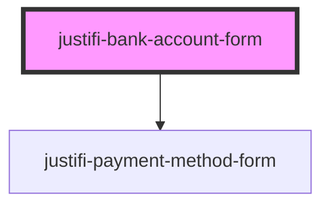

# justifi-card-form

<!-- Auto Generated Below -->

## Properties

| Property       | Attribute       | Description | Type     | Default     |
| -------------- | --------------- | ----------- | -------- | ----------- |
| `iframeOrigin` | `iframe-origin` |             | `string` | `undefined` |

## Events

| Event                     | Description | Type                          |
| ------------------------- | ----------- | ----------------------------- |
| `bankAccountFormBlur`     |             | `CustomEvent<any>`            |
| `bankAccountFormChange`   |             | `CustomEvent<any>`            |
| `bankAccountFormReady`    |             | `CustomEvent<any>`            |
| `bankAccountFormTokenize` |             | `CustomEvent<{ data: any; }>` |

## Methods

### `tokenize(clientKey: string, paymentMethodMetadata: any, account?: string) => Promise<any>`

#### Returns

Type: `Promise<any>`

## Dependencies

### Depends on

- [justifi-payment-method-form](../payment-method-form)

### Graph

----------------------------------------------

*Built with [StencilJS](https://stenciljs.com/)*
