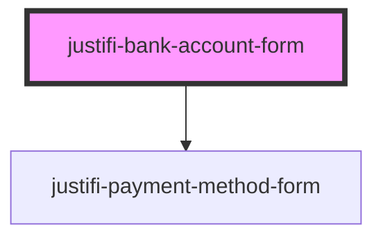

# justifi-bank-account-form


## Example
```html
<!DOCTYPE html>
<html dir="ltr" lang="en">

<head>
  <meta charset="utf-8" />
  <meta name="viewport" content="width=device-width, initial-scale=1.0, minimum-scale=1.0, maximum-scale=5.0" />
  <title>justifi-bank-account-form: Simple example</title>

  <!--
    If you are including the components via CDN the src should be the following:
    https://cdn.jsdelivr.net/npm/@justifi/webcomponents@2.1.0/dist/webcomponents/webcomponents.esm.js
  -->
  <script type="module" src="/build/webcomponents.esm.js"></script>
  <script nomodule src="/build/webcomponents.js"></script>
</head>

<body>
  <h1>Bank Account Form</h1>
  <hr>
  <!--
    The 'style-overrides' prop takes a stringified instance of Theme. The type and all optional
    members for Theme can be found here:
    https://github.com/justifi-tech/web-component-library/tree/main/stencil-library/src/components/payment-method-form/theme.ts
  -->
  <justifi-bank-account-form style-overrides='{
    "layout":{
      "padding":"0",
      "formControlSpacingHorizontal":".5rem",
      "formControlSpacingVertical":"1rem"
    },
    "formLabel":{
      "fontWeight":700,
      "fontFamily":"sans-serif",
      "margin":"0 0 .5rem 0"
    },
    "formControl":{
      "backgroundColor":"#F4F4F6",
      "backgroundColorHover":"#EEEEF5",
      "borderColor":"rgba(0, 0, 0, 0.42)",
      "borderColorHover":"rgba(0, 0, 0, 0.62)",
      "borderColorFocus":"#fccc32",
      "borderColorError":"#C12727",
      "borderWidth":"0px",
      "borderBottomWidth":"1px",
      "borderRadius":"4px 4px 0 0",
      "borderStyle":"solid",
      "boxShadowErrorFocus":"none",
      "boxShadowFocus":"none",
      "color":"#212529",
      "fontSize":"1rem",
      "fontWeight":"400",
      "lineHeight":"2",
      "margin":"0",
      "padding":".5rem .875rem"
    },
    "errorMessage":{
      "color":"#C12727",
      "margin":".25rem 0 0 0",
      "fontSize":".875rem"
    }
  }'></justifi-bank-account-form>
  <button type="submit" id="bank-account-submit-button">Tokenize</button>
  <button type="submit" id="bank-account-validate-button">Validate</button>
</body>

<script>
  (function () {
    var bankAccountForm = document.querySelector('justifi-bank-account-form');
    var bankAccountSubmitButton = document.querySelector('#bank-account-submit-button');
    var bankAccountValidateButton = document.querySelector('#bank-account-validate-button');

    bankAccountForm.addEventListener('bankAccountFormReady', function () {
      console.log('justifi-bank-account-form ready');
    });

    bankAccountSubmitButton.addEventListener('click', (event) => {
      console.log('bank account form tokenize button clicked');
      // All of this information would come from your form instead of being hard coded
      // Account / routing number are collected on our iframe
      const paymentMethodData = {
        name: 'John Doe', // can also pass account_owner_name
        account_type: 'checking', // checking or savings
        account_owner_type: 'individual' // individual or company
      };
      // ACCOUNT_ID is optional, currently required for platforms
      // ACCOUNT_ID is the seller account for which you are tokenizing
      bankAccountForm.tokenize('CLIENT_ID', paymentMethodData, 'ACCOUNT_ID')
        .then((data) => {
          // This is where you can submit the form and use the payment method token
          // on your backend
          console.log('justifi-bank-account-form tokenized: ', data);
        })
    });

    bankAccountValidateButton.addEventListener('click', (event) => {
      console.log('bank account validate button clicked');
      bankAccountForm.validate()
        .then((data) => {
          console.log('justifi-bank-account-form validated. Is valid? ', data.isValid);
        });
    });
  })();
</script>

</html>
```

## Styling
The `style-overrides` attribute below requires type `string`, but should be a stringified [`Theme`](https://github.com/justifi-tech/web-component-library/tree/main/stencil-library/src/components/payment-method-form/theme.ts)

<!-- Auto Generated Below -->


## Properties

| Property         | Attribute         | Description | Type                                                           | Default     |
| ---------------- | ----------------- | ----------- | -------------------------------------------------------------- | ----------- |
| `iframeOrigin`   | `iframe-origin`   |             | `string`                                                       | `undefined` |
| `styleOverrides` | `style-overrides` |             | `string`                                                       | `undefined` |
| `validationMode` | `validation-mode` |             | `"all" \| "onBlur" \| "onChange" \| "onSubmit" \| "onTouched"` | `undefined` |


## Events

| Event                     | Description | Type                                            |
| ------------------------- | ----------- | ----------------------------------------------- |
| `bankAccountFormReady`    |             | `CustomEvent<any>`                              |
| `bankAccountFormTokenize` |             | `CustomEvent<{ data: any; }>`                   |
| `bankAccountFormValidate` |             | `CustomEvent<{ data: { isValid: boolean; }; }>` |


## Methods

### `tokenize(clientId: string, paymentMethodMetadata: any, account?: string) => Promise<any>`


#### Returns

Type: `Promise<any>`


### `validate() => Promise<any>`


#### Returns

Type: `Promise<any>`


## Dependencies

### Depends on

- [justifi-payment-method-form](../payment-method-form)

### Graph


----------------------------------------------

*Built with [StencilJS](https://stenciljs.com/)*
