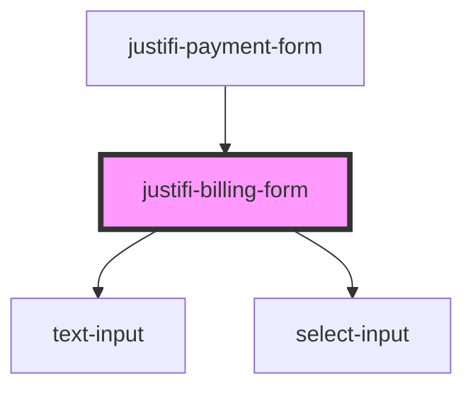

# billing-form

<!-- Auto Generated Below -->

## Methods

### `getValues() => Promise<BillingFormFields>`

#### Returns

Type: `Promise<BillingFormFields>`

### `validate() => Promise<{ isValid: boolean; }>`

#### Returns

Type: `Promise<{ isValid: boolean; }>`

## Dependencies

### Used by

 - [justifi-payment-form](../payment-form)

### Depends on

- [text-input](../text-input)
- [select-input](../select-input)

### Graph

----------------------------------------------

*Built with [StencilJS](https://stenciljs.com/)*
