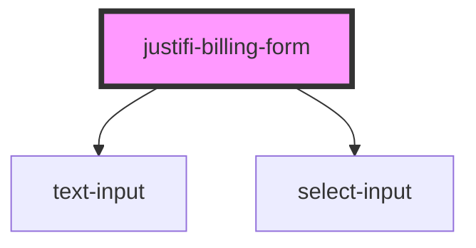

# billing-form

<!-- Auto Generated Below -->

## Methods

### `validate() => Promise<void>`

#### Returns

Type: `Promise<void>`

## Dependencies

### Depends on

- [text-input](../text-input)
- [select-input](../select-input)

### Graph

----------------------------------------------

*Built with [StencilJS](https://stenciljs.com/)*
