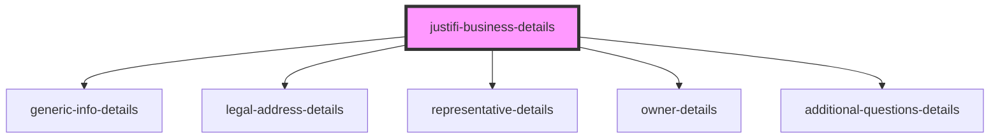

# justifi-business-details

<!-- Auto Generated Below -->

## Properties

| Property     | Attribute     | Description | Type     | Default     |
| ------------ | ------------- | ----------- | -------- | ----------- |
| `authToken`  | `auth-token`  |             | `string` | `undefined` |
| `businessId` | `business-id` |             | `string` | `undefined` |

## Dependencies

### Depends on

- [generic-info-details](generic-info-details)
- [legal-address-details](legal-address-details)
- [representative-details](representative-details)
- [owner-details](owner-details)
- [additional-questions-details](additional-questions-details)

### Graph

----------------------------------------------

*Built with [StencilJS](https://stenciljs.com/)*
