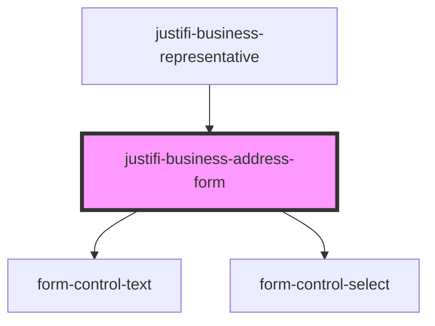

# justifi-business-address

<!-- Auto Generated Below -->

## Properties

| Property      | Attribute       | Description | Type        | Default     |
| ------------- | --------------- | ----------- | ----------- | ----------- |
| `form`        | --              |             | `FormState` | `undefined` |
| `subFormName` | `sub-form-name` |             | `string`    | `undefined` |

## Dependencies

### Used by

 - [justifi-business-representative](../business-representative)

### Depends on

- [form-control-text](../../form)
- [form-control-select](../../form)

### Graph

----------------------------------------------

*Built with [StencilJS](https://stenciljs.com/)*
