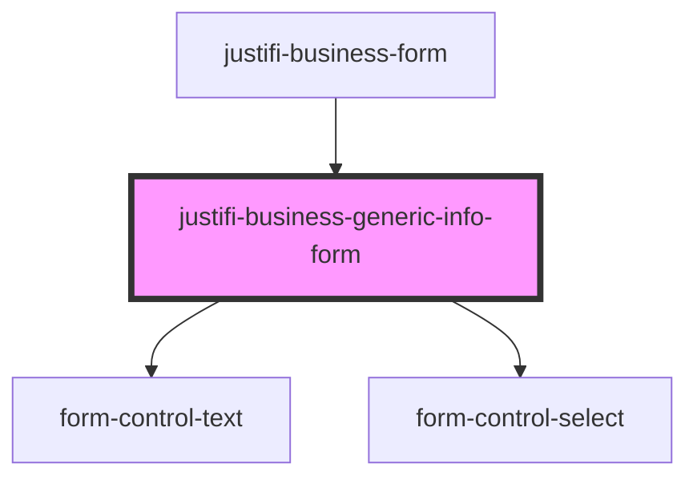

# justifi-business-generic-info-form

<!-- Auto Generated Below -->

## Properties

| Property        | Attribute        | Description | Type  | Default     |
| --------------- | ---------------- | ----------- | ----- | ----------- |
| `defaultValues` | `default-values` |             | `any` | `undefined` |
| `errors`        | `errors`         |             | `any` | `undefined` |

## Events

| Event               | Description | Type               |
| ------------------- | ----------- | ------------------ |
| `formControlChange` |             | `CustomEvent<any>` |

## Dependencies

### Used by

 - [justifi-business-form](..)

### Depends on

- [form-control-text](../../form)
- [form-control-select](../../form)

### Graph

----------------------------------------------

*Built with [StencilJS](https://stenciljs.com/)*
