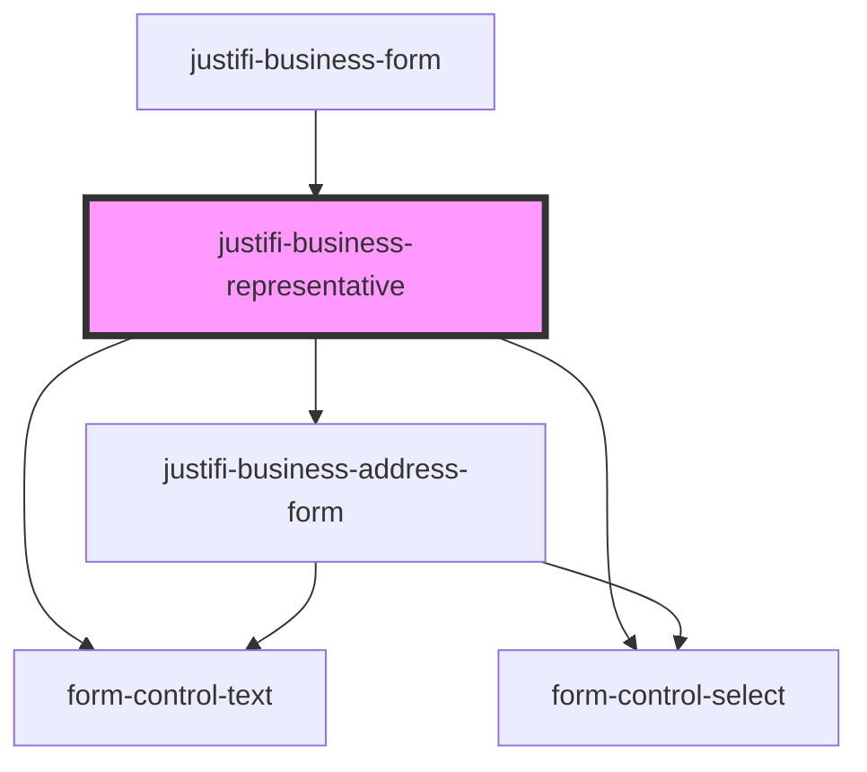

# justifi-business-representative

<!-- Auto Generated Below -->

## Properties

| Property | Attribute | Description | Type        | Default     |
| -------- | --------- | ----------- | ----------- | ----------- |
| `form`   | --        |             | `FormState` | `undefined` |

## Shadow Parts

| Part      | Description |
| --------- | ----------- |
| `"label"` |             |

## Dependencies

### Used by

 - [justifi-business-form](..)

### Depends on

- [form-control-text](../../form)
- [form-control-select](../../form)
- [justifi-business-address-form](../business-address)

### Graph

----------------------------------------------

*Built with [StencilJS](https://stenciljs.com/)*
