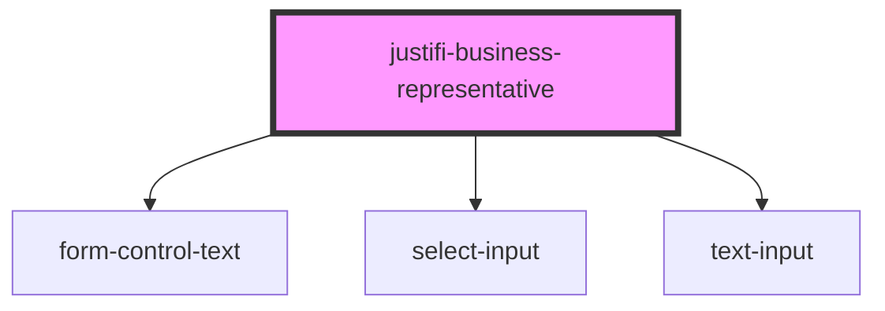

# justifi-business-representative

<!-- Auto Generated Below -->

## Properties

| Property         | Attribute | Description | Type                      | Default     |
| ---------------- | --------- | ----------- | ------------------------- | ----------- |
| `form`           | --        |             | `FormController`          | `undefined` |
| `representative` | --        |             | `IBusinessRepresentative` | `undefined` |

## Methods

### `getForm() => Promise<{ isValid: boolean; values: IBusinessRepresentative; }>`

#### Returns

Type: `Promise<{ isValid: boolean; values: IBusinessRepresentative; }>`

## Shadow Parts

| Part      | Description |
| --------- | ----------- |
| `"label"` |             |

## Dependencies

### Depends on

- [form-control-text](../../form)
- [select-input](../../select-input)
- [text-input](../../text-input)

### Graph

----------------------------------------------

*Built with [StencilJS](https://stenciljs.com/)*
