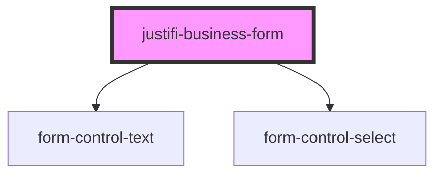

# justifi-business-info

<!-- Auto Generated Below -->

## Properties

| Property     | Attribute     | Description | Type     | Default     |
| ------------ | ------------- | ----------- | -------- | ----------- |
| `authToken`  | `auth-token`  |             | `string` | `undefined` |
| `businessId` | `business-id` |             | `string` | `undefined` |

## Methods

### `submit(event: any) => Promise<void>`

#### Returns

Type: `Promise<void>`

## Dependencies

### Depends on

- [form-control-text](../form)
- [form-control-select](../form)

### Graph

----------------------------------------------

*Built with [StencilJS](https://stenciljs.com/)*
