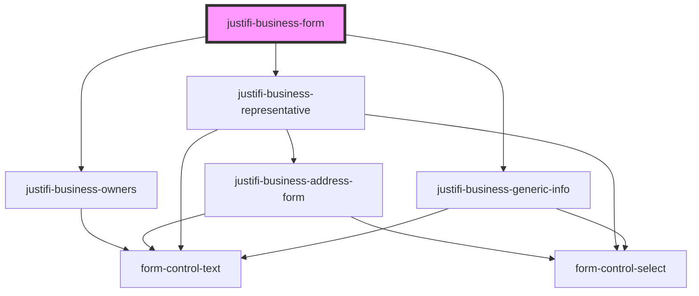

# justifi-business-info

<!-- Auto Generated Below -->

## Properties

| Property     | Attribute     | Description | Type     | Default     |
| ------------ | ------------- | ----------- | -------- | ----------- |
| `authToken`  | `auth-token`  |             | `string` | `undefined` |
| `businessId` | `business-id` |             | `string` | `undefined` |

## Dependencies

### Depends on

- [justifi-business-generic-info](business-generic-info)
- [justifi-business-representative](business-representative)
- [justifi-business-owners](business-owners)

### Graph

----------------------------------------------

*Built with [StencilJS](https://stenciljs.com/)*
