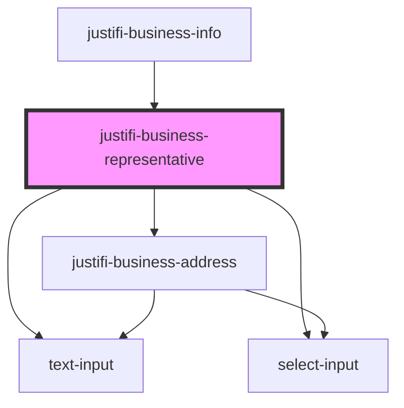

# justifi-business-representative

<!-- Auto Generated Below -->

## Methods

### `getForm() => Promise<{ isValid: boolean; values: IBusinessRepresentative; }>`

#### Returns

Type: `Promise<{ isValid: boolean; values: IBusinessRepresentative; }>`

## Dependencies

### Used by

 - [justifi-business-info](..)

### Depends on

- [text-input](../../text-input)
- [select-input](../../select-input)
- [justifi-business-address](../business-address)

### Graph

----------------------------------------------

*Built with [StencilJS](https://stenciljs.com/)*
