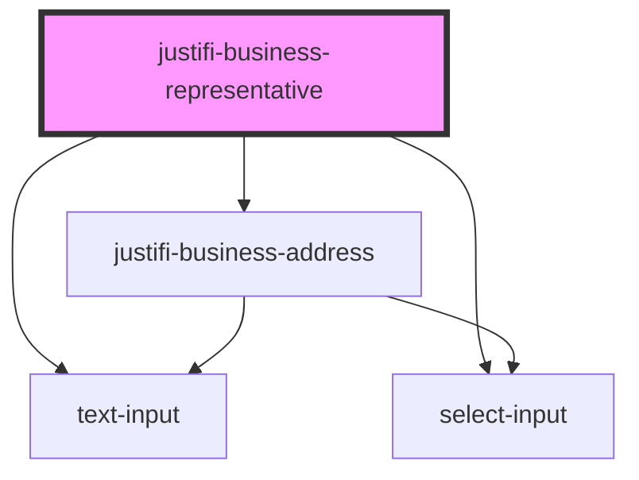

# justifi-business-representative

<!-- Auto Generated Below -->

## Properties

| Property           | Attribute            | Description | Type     | Default     |
| ------------------ | -------------------- | ----------- | -------- | ----------- |
| `hideSubmit`       | `hide-submit`        |             | `string` | `undefined` |
| `legend`           | `legend`             |             | `string` | `undefined` |
| `submitButtonText` | `submit-button-text` |             | `string` | `undefined` |

## Dependencies

### Depends on

- [text-input](../text-input)
- [select-input](../select-input)
- [justifi-business-address](../business-address)

### Graph

----------------------------------------------

*Built with [StencilJS](https://stenciljs.com/)*
