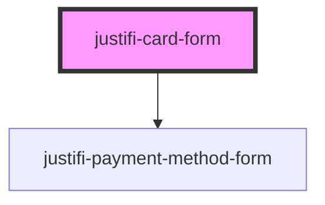

# justifi-card-form

<!-- Auto Generated Below -->

## Properties

| Property         | Attribute         | Description | Type                                                           | Default     |
| ---------------- | ----------------- | ----------- | -------------------------------------------------------------- | ----------- |
| `iframeOrigin`   | `iframe-origin`   |             | `string`                                                       | `undefined` |
| `singleLine`     | `single-line`     |             | `boolean`                                                      | `undefined` |
| `validationMode` | `validation-mode` |             | `"all" \| "onBlur" \| "onChange" \| "onSubmit" \| "onTouched"` | `undefined` |

## Events

| Event              | Description | Type                                            |
| ------------------ | ----------- | ----------------------------------------------- |
| `cardFormReady`    |             | `CustomEvent<any>`                              |
| `cardFormTokenize` |             | `CustomEvent<{ data: any; }>`                   |
| `cardFormValidate` |             | `CustomEvent<{ data: { isValid: boolean; }; }>` |

## Methods

### `tokenize(clientId: string, paymentMethodMetadata: any, account?: string) => Promise<any>`

#### Returns

Type: `Promise<any>`

### `validate() => Promise<any>`

#### Returns

Type: `Promise<any>`

## Dependencies

### Depends on

- [justifi-payment-method-form](../payment-method-form)

### Graph

----------------------------------------------

*Built with [StencilJS](https://stenciljs.com/)*
