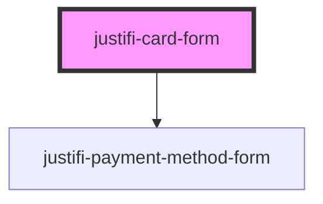

# justifi-card-form

<!-- Auto Generated Below -->

## Properties

| Property         | Attribute         | Description                                                        | Type                                                           | Default     |
| ---------------- | ----------------- | ------------------------------------------------------------------ | -------------------------------------------------------------- | ----------- |
| `iframeOrigin`   | `iframe-origin`   | URL for the rendered iFrame. End-users need not use this.          | `string`                                                       | `undefined` |
| `singleLine`     | `single-line`     | Boolean indicating if the Card Form should render in a single line | `boolean`                                                      | `false`     |
| `validationMode` | `validation-mode` | When to trigger validation of the form.                            | `"all" \| "onBlur" \| "onChange" \| "onSubmit" \| "onTouched"` | `undefined` |

## Events

| Event              | Description                                                   | Type                                            |
| ------------------ | ------------------------------------------------------------- | ----------------------------------------------- |
| `cardFormReady`    | Triggered when iframe has loaded                              | `CustomEvent<any>`                              |
| `cardFormTokenize` | Triggered when the tokenize method is called on the component | `CustomEvent<{ data: any; }>`                   |
| `cardFormValidate` | Triggered when the validate method is called on the component | `CustomEvent<{ data: { isValid: boolean; }; }>` |

## Methods

### `tokenize(...args: Parameters<HTMLJustifiPaymentMethodFormElement['tokenize']>) => Promise<CreatePaymentMethodResponse>`

Makes a tokenization request to the iframe

#### Returns

Type: `Promise<CreatePaymentMethodResponse>`

### `validate() => Promise<{ isValid: boolean; }>`

Runs a validation on the form and shows errors if any

#### Returns

Type: `Promise<{ isValid: boolean; }>`

## Dependencies

### Depends on

- [justifi-payment-method-form](../payment-method-form)

### Graph

----------------------------------------------

*Built with [StencilJS](https://stenciljs.com/)*
