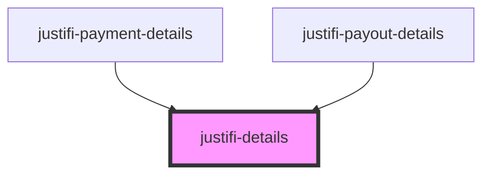

# justifi-details

<!-- Auto Generated Below -->

## Properties

| Property       | Attribute       | Description | Type                 | Default     |
| -------------- | --------------- | ----------- | -------------------- | ----------- |
| `entity`       | --              |             | `{ metadata: any; }` | `undefined` |
| `errorMessage` | `error-message` |             | `string`             | `undefined` |

## Shadow Parts

| Part                      | Description |
| ------------------------- | ----------- |
| `"detail-metadata"`       |             |
| `"detail-metadata-title"` |             |

## Dependencies

### Used by

 - [justifi-payment-details](../payment-details)
 - [justifi-payout-details](../payout-details)

### Graph

----------------------------------------------

*Built with [StencilJS](https://stenciljs.com/)*
