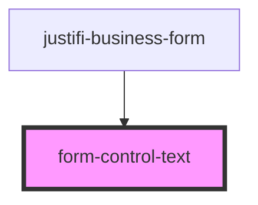

# form-control-text

<!-- Auto Generated Below -->

## Properties

| Property  | Attribute | Description | Type                 | Default     |
| --------- | --------- | ----------- | -------------------- | ----------- |
| `error`   | `error`   |             | `string`             | `undefined` |
| `label`   | `label`   |             | `string`             | `undefined` |
| `name`    | `name`    |             | `any`                | `undefined` |
| `onInput` | --        |             | `(e: Event) => void` | `undefined` |
| `value`   | `value`   |             | `string`             | `undefined` |

## Shadow Parts

| Part      | Description |
| --------- | ----------- |
| `"label"` |             |

## Dependencies

### Used by

 - [justifi-business-form](../business-form)

### Graph

----------------------------------------------

*Built with [StencilJS](https://stenciljs.com/)*
