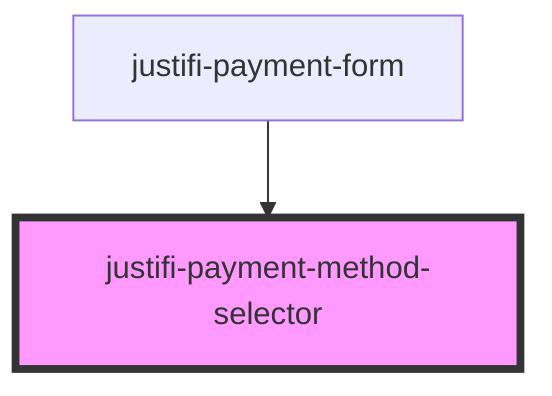

# justifi-payment-method-selector

<!-- Auto Generated Below -->

## Properties

| Property                    | Attribute                      | Description | Type                                                        | Default     |
| --------------------------- | ------------------------------ | ----------- | ----------------------------------------------------------- | ----------- |
| `paymentMethodTypes`        | --                             |             | `PaymentMethodTypes[]`                                      | `[]`        |
| `selectedPaymentMethodType` | `selected-payment-method-type` |             | `PaymentMethodTypes.bankAccount \| PaymentMethodTypes.card` | `undefined` |

## Events

| Event                   | Description | Type               |
| ----------------------- | ----------- | ------------------ |
| `paymentMethodSelected` |             | `CustomEvent<any>` |

## Dependencies

### Used by

 - [justifi-payment-form](.)

### Graph

----------------------------------------------

*Built with [StencilJS](https://stenciljs.com/)*
