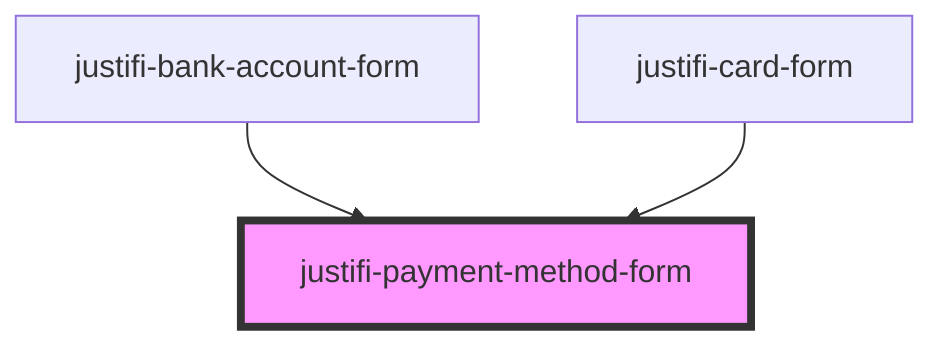

# justifi-payment-method-form

<!-- Auto Generated Below -->

## Properties

| Property                | Attribute                  | Description | Type                       | Default     |
| ----------------------- | -------------------------- | ----------- | -------------------------- | ----------- |
| `paymentMethodFormType` | `payment-method-form-type` |             | `"bank-account" \| "card"` | `undefined` |

## Events

| Event                       | Description | Type                          |
| --------------------------- | ----------- | ----------------------------- |
| `paymentMethodFormReady`    |             | `CustomEvent<any>`            |
| `paymentMethodFormTokenize` |             | `CustomEvent<{ data: any; }>` |

## Methods

### `tokenize(clientKey: string, paymentMethodMetadata: any, account?: string) => Promise<any>`

#### Returns

Type: `Promise<any>`

## Dependencies

### Used by

 - [justifi-bank-account-form](../bank-account-form)
 - [justifi-card-form](../card-form)

### Graph

----------------------------------------------

*Built with [StencilJS](https://stenciljs.com/)*
