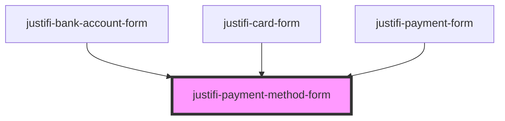

# justifi-payment-method-form

This component is intended for internal use by `justifi-card-form` and `justifi-bank-account-form`

<!-- Auto Generated Below -->

## Properties

| Property                              | Attribute                                 | Description | Type                                                           | Default     |
| ------------------------------------- | ----------------------------------------- | ----------- | -------------------------------------------------------------- | ----------- |
| `iframeOrigin`                        | `iframe-origin`                           |             | `string`                                                       | `undefined` |
| `paymentMethodFormType`               | `payment-method-form-type`                |             | `"bankAccount" \| "card"`                                      | `undefined` |
| `paymentMethodFormValidationStrategy` | `payment-method-form-validation-strategy` |             | `"all" \| "onBlur" \| "onChange" \| "onSubmit" \| "onTouched"` | `undefined` |
| `paymentMethodStyleOverrides`         | --                                        |             | `Theme`                                                        | `undefined` |

## Events

| Event                       | Description | Type                          |
| --------------------------- | ----------- | ----------------------------- |
| `paymentMethodFormReady`    |             | `CustomEvent<any>`            |
| `paymentMethodFormTokenize` |             | `CustomEvent<{ data: any; }>` |

## Methods

### `tokenize(clientId: string, paymentMethodMetadata: any, account?: string) => Promise<any>`

#### Returns

Type: `Promise<any>`

### `validate() => Promise<any>`

#### Returns

Type: `Promise<any>`

## Dependencies

### Used by

 - [justifi-bank-account-form](../bank-account-form)
 - [justifi-card-form](../card-form)
 - [justifi-payment-form](../payment-form)

### Graph

----------------------------------------------

*Built with [StencilJS](https://stenciljs.com/)*
