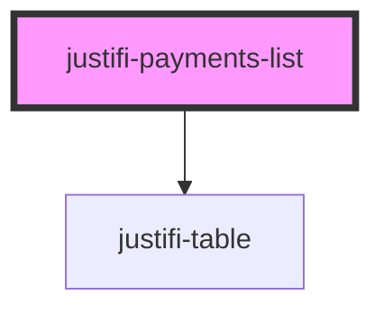

# justifi-payments-list

<!-- Auto Generated Below -->

## Properties

| Property    | Attribute    | Description | Type     | Default     |
| ----------- | ------------ | ----------- | -------- | ----------- |
| `accountId` | `account-id` |             | `string` | `undefined` |
| `authToken` | `auth-token` |             | `string` | `undefined` |

## Events

| Event                 | Description | Type                   |
| --------------------- | ----------- | ---------------------- |
| `payment-row-clicked` |             | `CustomEvent<Payment>` |

## Dependencies

### Depends on

- [justifi-table](../table)

### Graph

----------------------------------------------

*Built with [StencilJS](https://stenciljs.com/)*
