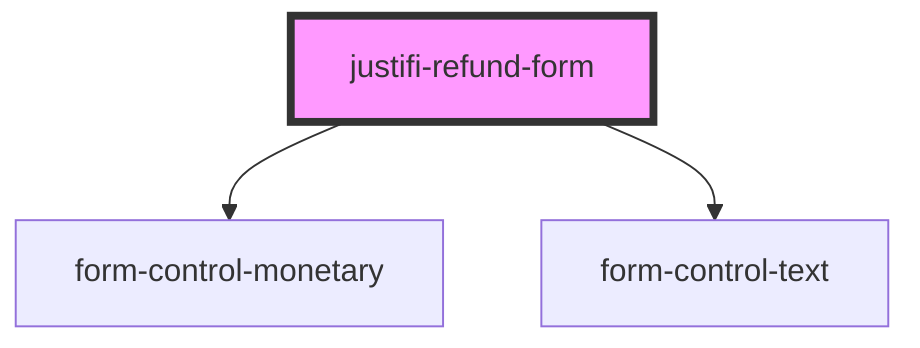

# justifi-refund-form

<!-- Auto Generated Below -->

## Properties

| Property           | Attribute            | Description                                                        | Type      | Default     |
| ------------------ | -------------------- | ------------------------------------------------------------------ | --------- | ----------- |
| `amount`           | `amount`             | The amount of the payment to be refunded.                          | `number`  | `0`         |
| `authToken`        | `auth-token`         | Authentication token required to authorize the refund transaction. | `string`  | `undefined` |
| `paymentId`        | `payment-id`         | The unique identifier for the payment to be refunded.              | `string`  | `undefined` |
| `refundInfoText`   | `refund-info-text`   | Optional information text displayed above the form.                | `string`  | `undefined` |
| `submitButtonText` | `submit-button-text` | Custom text for the submit button. Defaults to 'Submit'.           | `string`  | `'Submit'`  |
| `withButton`       | `with-button`        | Flag to control the visibility of the submit button.               | `boolean` | `undefined` |

## Events

| Event       | Description                                                                                                               | Type                            |
| ----------- | ------------------------------------------------------------------------------------------------------------------------- | ------------------------------- |
| `submitted` | Event emitted when the refund form is successfully submitted. The submitted refund fields are passed as the event detail. | `CustomEvent<RefundFormFields>` |

## Dependencies

### Depends on

- [form-control-monetary](../form)
- [form-control-text](../form)

### Graph

----------------------------------------------

*Built with [StencilJS](https://stenciljs.com/)*
