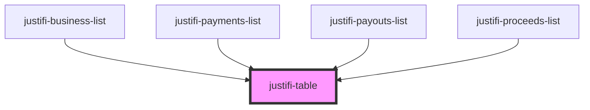

# justifi-table

<!-- Auto Generated Below -->

## Properties

| Property                  | Attribute       | Description | Type                     | Default                  |
| ------------------------- | --------------- | ----------- | ------------------------ | ------------------------ |
| `columnData` _(required)_ | --              |             | `(string \| string[])[]` | `undefined`              |
| `entityId`                | --              |             | `string[]`               | `undefined`              |
| `errorMessage`            | `error-message` |             | `string`                 | `''`                     |
| `loading`                 | `loading`       |             | `boolean`                | `true`                   |
| `paging`                  | --              |             | `ExtendedPagingInfo`     | `ExtendedPagingDefaults` |
| `rowClickHandler`         | --              |             | `(e: any) => any`        | `undefined`              |
| `rowData`                 | --              |             | `any[]`                  | `[]`                     |

## Shadow Parts

| Part                      | Description |
| ------------------------- | ----------- |
| `"arrow"`                 |             |
| `"arrow-left"`            |             |
| `"arrow-right"`           |             |
| `"empty-state"`           |             |
| `"error-state"`           |             |
| `"loading-state-cell"`    |             |
| `"loading-state-spinner"` |             |
| `"next-button-text"`      |             |
| `"pagination-bar"`        |             |
| `"previous-button-text"`  |             |
| `"table-body"`            |             |
| `"table-cell"`            |             |
| `"table-head"`            |             |
| `"table-head-cell"`       |             |
| `"table-head-row"`        |             |

## Dependencies

### Used by

 - [justifi-business-list](../business-list)
 - [justifi-payments-list](../payments-list)
 - [justifi-payouts-list](../payouts-list)
 - [justifi-proceeds-list](../proceeds-list)

### Graph

----------------------------------------------

*Built with [StencilJS](https://stenciljs.com/)*
