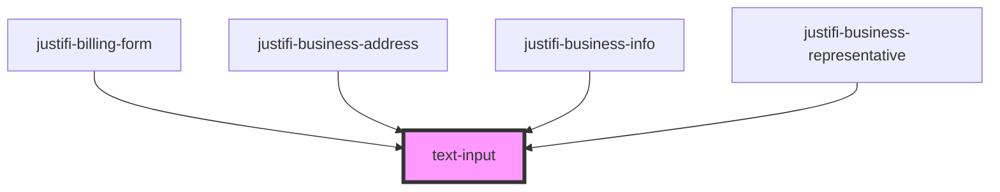

# text-field

<!-- Auto Generated Below -->

## Properties

| Property       | Attribute       | Description | Type     | Default     |
| -------------- | --------------- | ----------- | -------- | ----------- |
| `defaultValue` | `default-value` |             | `string` | `undefined` |
| `error`        | `error`         |             | `string` | `undefined` |
| `label`        | `label`         |             | `string` | `undefined` |
| `name`         | `name`          |             | `string` | `undefined` |

## Events

| Event                | Description | Type                                            |
| -------------------- | ----------- | ----------------------------------------------- |
| `fieldReceivedInput` |             | `CustomEvent<{ name: string; value: string; }>` |

## Shadow Parts

| Part      | Description |
| --------- | ----------- |
| `"label"` |             |

## Dependencies

### Used by

 - [justifi-billing-form](../billing-form)
 - [justifi-business-address](../business-info/business-address)
 - [justifi-business-info](../business-info)
 - [justifi-business-representative](../business-info/business-representative)

### Graph

----------------------------------------------

*Built with [StencilJS](https://stenciljs.com/)*
